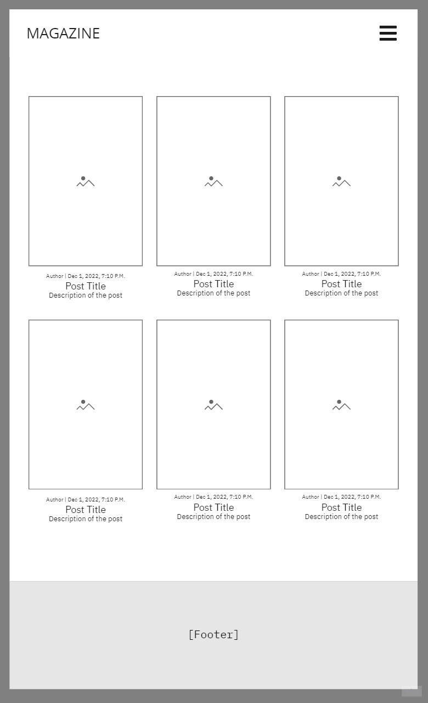

# Magazine 
Magazine is a website where people share and get inspired by interior designs. The website is targeted toward those who want to share, read and learn about interior design. The website is useful for tho.se who want to know what is trending right now. 
All website users can create an account and share what their homes look like or anything regarding interior design.

The website owner can delete comments and posts, if it is inappropriate. This is done from the Admin Dashboard that is only accessible to the Website owner when they log in.

# Project

## Site Owner Goal
The site's Owner's goal is to have a website where people who love interior design can have a space to read about and share their own tips and tricks about interior design. The website will have people inspired and people who inspire.

 

## Site User Goal
The site's user goal is to have a place to read about and share their own tips and tricks about interior design.

 

# Project Management
I have used the github project board to work with the blog.

GitHub Board

 

### Models Graph
I have used Graph models to render a graphical overview of the blog models. It shows how the models are connected to each other in the database.
I used [Dreampuf](https://dreampuf.github.io/GraphvizOnline/#digraph%20G%20%7B%0A%0A%20%20subgraph%20cluster_0%20%7B%0A%20%20%20%20style%3Dfilled%3B%0A%20%20%20%20color%3Dlightgrey%3B%0A%20%20%20%20node%20%5Bstyle%3Dfilled%2Ccolor%3Dwhite%5D%3B%0A%20%20%20%20a0%20-%3E%20a1%20-%3E%20a2%20-%3E%20a3%3B%0A%20%20%20%20label%20%3D%20%22process%20%231%22%3B%0A%20%20%7D%0A%0A%20%20subgraph%20cluster_1%20%7B%0A%20%20%20%20node%20%5Bstyle%3Dfilled%5D%3B%0A%20%20%20%20b0%20-%3E%20b1%20-%3E%20b2%20-%3E%20b3%3B%0A%20%20%20%20label%20%3D%20%22process%20%232%22%3B%0A%20%20%20%20color%3Dblue%0A%20%20%7D%0A%20%20start%20-%3E%20a0%3B%0A%20%20start%20-%3E%20b0%3B%0A%20%20a1%20-%3E%20b3%3B%0A%20%20b2%20-%3E%20a3%3B%0A%20%20a3%20-%3E%20a0%3B%0A%20%20a3%20-%3E%20end%3B%0A%20%20b3%20-%3E%20end%3B%0A%0A%20%20start%20%5Bshape%3DMdiamond%5D%3B%0A%20%20end%20%5Bshape%3DMsquare%5D%3B%0A%7D) to translate the DOT language into the graph.

# Wireframes
I have used [Miro](https://miro.com/) to create WireFrames for the project.
The website have some differences.

Wireframes

 

#### Wireframes

 

# User Experience (UX)
## Site User

| User/Admin | Description |
| --- | --- |
| Site User | As a Site User I can View posts so that I can select one to read |
| Site User | As a site user I can read comments that are made for a specific post so that I can read what people think of the post |
| Site User | As a Site User I can create an account so that I can comment and create content |
| Site User | As a Site User I can create a post so that I can make content for the blog |
| Site User | As a Site User I can comment posts so that I can write what I think about the post and interact with other blog readers |
| Site User | As a site user I can delete comments I have made so that I have control over my comments, and can remove them if I change my mind on the comments |
| Site User | As a Site user I can go to a profile page specifically for me so that I can find all posts created by me |
| Site User | As a Site User I can login so that I can create content for the blog that is connected to my account |
| Site User | As a Site User I can logout so that someone else using my computer can't post from my account |

 

## Site Owner

| User/Admin | Description |
| --- | --- |
| Site Owner | All Site User stories apply to the Site Owner |
| Site Owner | As a Site Owner I can go to the Admin Dashboard where I can find all posts made and information about them |
| Site Owner | As a Site Owner I can find all posts and all comments created in one page so that I can manage the content on the website |
| Site Owner | As a Site Owner I can go to the Admin Dashboard where I can find all comments made and information about them |
| Site Owner | As a Site Owner I can I can delete the posts and comments from the admin page so that I can manage a secure environment for the users |

 

# Features

 

### Features on all pages
* Navigation Bar
  * Featured on all pages. The navigation bar includes links to the logo, homepage, blog page, login page and SignUp page.
  * This allows the user to easily navigate through the website.
  * When the user is logged in the navigation bar also links to Create Post page, Profile page, and it has a Log out link so the user can easily log out from their account.
  * When the website owner is logged in the same links as the logged in user will display as well as an Admin link for the Admin dashboard.

* The footer
  * The footer links to Magazine's social media accounts.

### The Landing/home page
  * The landing page has an image of furniture and text that says 'MAGAZINE' and 'Interior & Lifestyle' This lets the user know what the website is about.
  * The home page displays the six latest posts made so the user can see what the latest interior trends are and also so they can see examples of what type of content they will find on the page. 

 
 ### Blog

 * The blog page displays all posts made with the latest ones on top of the page.

### Sign up
* The SignUp page displays a form where the user writes their information to create an account.

### Log in
* The log in page displays a form where the user writes their username and password to log in to their account.

### Profile
* The profile page displays the user profile picture, user bio and three buttons.
    * The Edit Profile button leads to the edit profile page where they can add a profile picture and write text about themselves.
    * The Change password button leads to a page where they can change their password.
    * The My Posts button leads to a page where they can find all posts they have created.

### Create Post
* In the create post page a user can create a post by adding text and image to the create post form. The form has four fields.
    * Title | Name of the blog post.
    * Article description | Description of the article. This is the first thing the user reads before deciding what post to read more about.
    * Content | The post content.
    * Image | The image that will be posted with the post text content.

### Admin Dashboard
* In the admin the website owner can see how many posts have been made, how many accounts have been created and how many comments have been made.
* On this page the owner can find all posts, who the author is, the title, the article description, the date it was created and the content.
    * The owner can Delete posts from this page.
* On this page the owner can find all the comments, the name of who has created the comment, the date the comment was created, the comment content, and what post it was commented on.
    * The owner can delete comments from this page.

### Features left to Implement

## Testing
[responsivedesignchecker](https://www.responsivedesignchecker.com/)
[HTML validator](https://validator.w3.org/)

[CSS validator](https://jigsaw.w3.org/css-validator/)

[Jshint](https://jshint.com/)

### Lighthouse
The website has also been tested with the Chrome developer tool Google Lighthouse. It has been tested for desktop and for mobile. What was tested:

* Performance
* Accessibility
* Best Practices
* SEO (Search engine optimisation)
 

Lighthouse

### Home page 
#### Desktop

#### Mobile

 

### Blog page 
#### Desktop

#### Mobile

### Signup page 
#### Desktop

#### Mobile

### Login page 
#### Desktop

#### Mobile

### Create post page 
#### Desktop

#### Mobile

### Profile page 
#### Desktop

#### Mobile

### Edit profile page 
#### Desktop

#### Mobile

### Change password page 
#### Desktop

#### Mobile

### User posts page 
#### Desktop

#### Mobile

### Admin page 
#### Desktop

#### Mobile

 

## Technologies Used
* Python
* Django
* HTML5 - For structure of the website
* CSS3 - For styling of the website
* GitHub - Used to host the website
* GitPod - For deployment of the website
* [Miro](https://miro.com/) - For creating the Wireframes

### Libraries
* pip3 install Pillow
* pip3 install 'django<4' gunicorn
* pip3 install dj_database_url==0.5.0 psycopg2
* pip3 install dj3-cloudinary-storage
* pip install django-extensions
* pip install pyparsing pydot
* pip3 freeze --local > requirements.txt
<!-- 
python3 manage.py graph_models --pydot -a -g -o my_project_visualized.png
/manage.py graph_models -a > my_project.dot
--> 

### Validators

### Unfixed Bugs

## Deployment

Deployment

Create a GitHub repository from the Code Institute template and click 'Use this template'

 
Add a repository name and then click 'Create repository from template'

 
When the repository is created click 'Gitpod'

 

In the terminal type the following commands to install Django and its supporting libraries:

 
After the libraries have been installed type the following command to create a requirements.txt file
 requirements.txt' typed in the terminal" style="width: 100%">

 
Create the Django project by typing the following command

After typing the command this 'blog' folder with files will be displayed in the directory

  
 
Create the Django application by typing the following command

After typing the command this 'magazine' with files will be displayed in the directory

 

In the settings.py in the blog folder add the application (add 'magazine') to the 'INSTALLED_APPS' section as shown in following image

 

In the terminal type 'python3 manage.py migrate'
  
 

In the terminal type 'python3 manage.py runserver' and click 'Open Browser'
  
 
The following image is what the website will look like
  

 

Create or login to [Heroku](https://www.heroku.com/)

In the heroku Website click 'New' and after click 'Create new app'
  

 

Write the app name, choose a region and then click 'Create app' 
  
 

In the application website click 'Deploy' on the navigation menu
  
 

In the 'Deploy' page follow these steps:
  1 Click the GitHub logo
  2 Search for the GitHub repository that was made for this project
  3 When the repository is found click 'Connect'
  
 

### Create database

[ElephantSQL](https://www.elephantsql.com/) 
Start with clicking 'Create New Instance'
 

 

Enter a name for the database and then click 'Select Region'
  
 

Select a region and then click Review
  
 

Review the information and click 'Create Instance'
  
 

When the instance is created it will be displayed on top of the list of created instances
Click the instance that has been created

 

Copy the Url
 
 

Create a 'env.py' file on the top level directory
 
 

In the 'env.py' file add the following text
 
 

Add the following text and in the red area paste the Url copied from the instance that was created in [ElephantSQL](https://www.elephantsql.com/)
 
  
 

In the 'settings.py' file copy the value of 'SECRET_KEY' (The secret key is removed from image because it has to be kept secret)
 
 

In the 'env.py' file add the following text and paste the secret key as value
 
 

Add the following text on top of the 'setting.py' file
 
 

Add the following replace the value of 'SECRET_KEY' and add the following text
 
 

  1 Comment out the database that is in the 'settings.py' file
  2 Add the following text to connect the new database
 
 

In the terminal type the following command
 
 

In [ElephantSQL](https://www.elephantsql.com/) in the instance that was created click 'Browser' 
 
 

In the 'Browser' page click 'Table queries' and the database will be displayed
 

 

In the application in heroku click 'Settings' in the navigation menu. After click 'Reveal Config Vars'
Add the following keys and in the red area add their values
 

[Cloudinary](https://cloudinary.com/) Create an account or log in to cloudinary.

 

In 'API Environment variable' copy the value as shown below
 
 

In the 'env.py' file add 'os.environ["CLOUDINARY_URL"]' and paste the link that was copied from cloudinary
 
 

In the 'settings.py' file add 'cloudinary_storage' and 'cloudinary' as shown below
 
 

Add the following text in the 'settings.py' file
 
 

Add the following text as shown below in the 'settings.py' file
 
 

Add the following text as shown below in the 'settings.py' file
 
 

Create these folders on the top level directory
 
 

Creata a 'Procfile' file on the top level directory
 
 

In the 'Procfile' file add the following text.

After push the project to GitHub.
 

In the application in Heroku navigate to the deploy page and scroll to the bottom of the page
 
 

Click 'Deploy Branch'
Wait for the GitHub branch to be deployed and then click 'View App'
 
 

This is what the app will look like when its successfully deployed
 

 

## Credits
* https://dontrepeatyourself.org/post/django-blog-tutorial-part-1-project-configuration/
### Content
### Media
#### Images
* Image by rawpixel.com https://www.rawpixel.com/image/6012980/illustration-png-social-media-logo
* Bild av Olena Bohovyk: https://www.pexels.com/sv-se/foto/romantisk-mork-vinter-hus-5686478/
* Bild av Maria Orlova: https://www.pexels.com/sv-se/foto/kreativ-vagg-hus-vaxt-4915834/
* Bild av PNW Production: https://www.pexels.com/sv-se/foto/sang-vaxt-vit-design-8251666/
* Bild av Maksim Goncharenok: https://www.pexels.com/sv-se/foto/tra-vagg-bord-lyx-4352247/
* Bild av Nugroho  Wahyu: https://www.pexels.com/sv-se/foto/inne-tra-design-rum-3119180/ hero image
## Bugs
In the forms errors never showed on the page. In stackoverflow I finally found a solution.

* https://stackoverflow.com/questions/64054215/display-django-registration-form-errors

